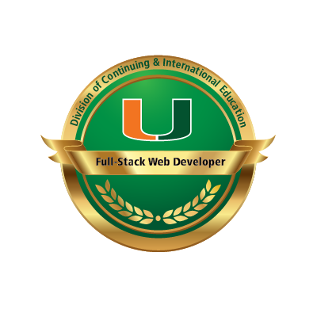

##

## 👋 Introduction

Hi, I'm Martin Cespedes—your go-to full-stack developer, fueled by a passion for crafting innovative solutions to real-world challenges. I excel in cutting-edge technologies such as CSS, HTML, JavaScript, Node.js, Express.js, MySQL, Handlebars.js, MongoDB and React. Eager to contribute to fast-paced development teams, I'm on a constant quest for skill growth and knowledge expansion in this ever-evolving industry. Let's make an impact together!

## 🛠️ Tech Tools

  
  
  
  
  
  
  
  
  
  
  
  
  
  
  

## 🌱 I am currently learning

 

## 📫 Contact

 &nbsp;  &nbsp;

## 📈 GitHub Stats

 &nbsp;

